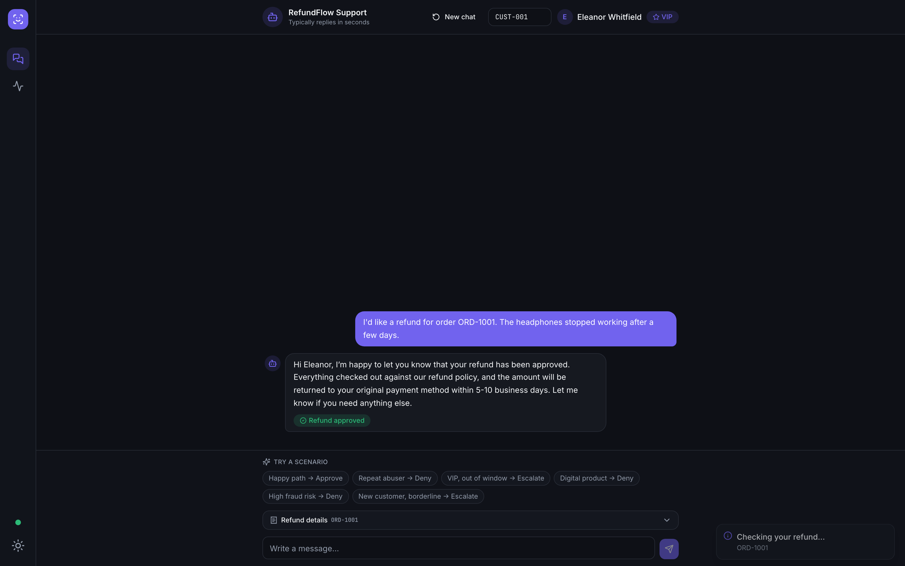
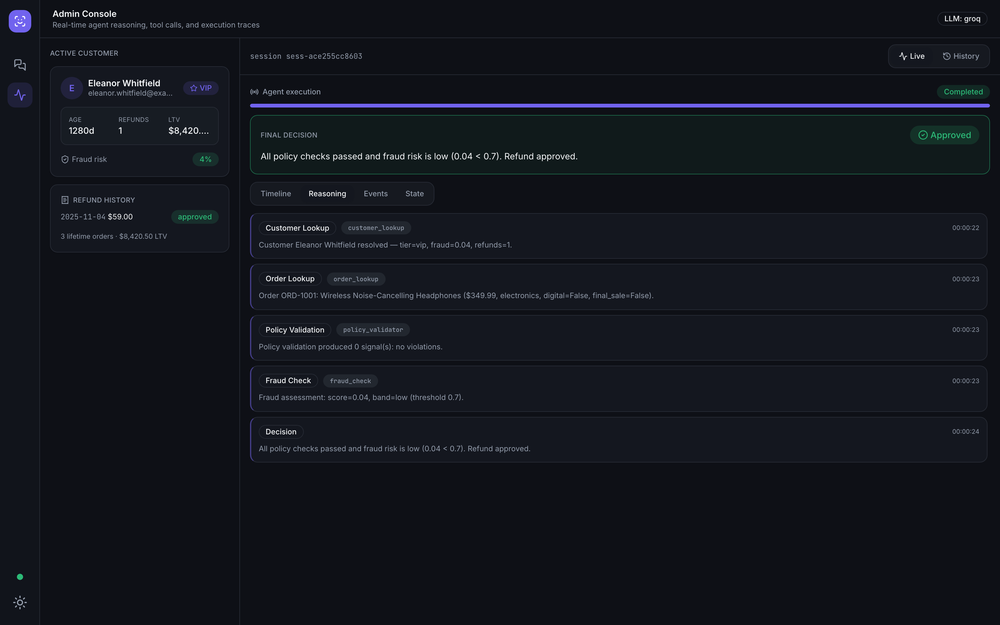

# RefundFlow AI — AI-Powered Customer Support Agent

An end-to-end AI customer support system for e-commerce. A customer chats (or talks via voice) to request a refund; a **LangGraph** agent looks up the customer and order, validates the request against a strict 7-rule policy, runs a fraud check, and deterministically returns **APPROVED**, **DENIED**, or **ESCALATED**. An admin operations console streams every tool call, reasoning step, and LLM event in real time.

Built with **FastAPI + LangGraph** on the backend and **React + TypeScript** on the frontend, with a **LiveKit** voice channel (Maya) that reuses the exact same decision engine.



---

## What makes this interesting

**The LLM never makes the refund decision.** Deterministic tools and a policy engine decide; the LLM is only used to phrase the customer-facing reply — and it receives only a pre-computed, customer-safe reason, never the internal rationale, so fraud scores and policy rule IDs can never leak into the chat.

This means:
- Every decision is reproducible, auditable, and traceable.
- The app runs with **zero API keys** — the LLM phrasing layer degrades gracefully to a deterministic template responder.
- Any major LLM provider (Anthropic, Groq, OpenAI, Gemini, Mistral, Ollama) swaps in with four lines of `.env` config.
- The **same decision engine** powers both text and voice — two front-ends over one deterministic core.

---

## How a refund request flows

```
Customer message
      │
      ▼
  ChatService
  ├─ classify_intent (LLM)
  ├─ resolve_order (LLM + validation)
  │
  ├─► [slot filling — ask for order / reason if missing]
  │
  └─► RefundService.process_refund()
            │
            ▼
       LangGraph (5 nodes, linear)
       ┌─────────────────────────────────────────────────┐
       │  customer_lookup → order_lookup                  │
       │       → policy_validation → fraud_check          │
       │             → decision (APPROVED/DENIED/ESCALATED)│
       └─────────────────────────────────────────────────┘
            │ (SSE events stream to admin dashboard live)
            ▼
       LLMService.phrase_decision()
            │ (phrases the customer-facing reply, never alters the verdict)
            ▼
       ChatResponse → customer + admin dashboard
```

After a decision is made, subsequent turns (follow-ups, "bye", "connect me to a human") are handled by a **separate conversational LangGraph** (`chat_graph.py`) with full message history, so the bot carries on a real back-and-forth instead of replaying a canned answer.

---

## Tech stack

| Layer | Technology |
|---|---|
| Agent workflow | LangGraph 0.2 (state machine with MemorySaver checkpointing) |
| Conversational loop | LangGraph + `add_messages` reducer (per-conversation memory) |
| Backend | FastAPI 0.115, Pydantic v2, SQLAlchemy 2, SQLite, structlog |
| Real-time | Server-Sent Events (`sse-starlette`) — no polling |
| LLM phrasing | LangChain (provider-agnostic: Anthropic, Groq, OpenAI, Gemini, Mistral, Ollama) |
| Voice | LiveKit Agents SDK (STT → LLM → TTS via LiveKit hosted inference) |
| Frontend | React 18, TypeScript, Vite, TailwindCSS v3, Framer Motion |
| Data fetching / state | TanStack Query v5, Zustand v5 |
| Testing | pytest (54 backend tests), Vitest + React Testing Library (9 tests) |

---

## Project structure

```
refundflow-ai/
├── backend/
│   ├── app/
│   │   ├── agents/
│   │   │   ├── graph.py             # Refund LangGraph (5 nodes, linear)
│   │   │   ├── chat_graph.py        # Conversational LangGraph (multi-turn memory)
│   │   │   ├── state.py             # AgentState TypedDict
│   │   │   ├── refund_agent.py      # Graph executor / RefundAgent
│   │   │   └── nodes/               # One module per node (customer, order, policy, fraud, decision)
│   │   ├── tools/                   # 4 deterministic tools
│   │   │   ├── customer_lookup.py
│   │   │   ├── order_lookup.py
│   │   │   ├── policy_validator.py
│   │   │   └── fraud_checker.py
│   │   ├── services/
│   │   │   ├── chat_service.py      # Conversational entry point, slot-filling, session state
│   │   │   ├── refund_service.py    # Orchestrates one graph run
│   │   │   ├── decision_service.py  # Pure decision logic (HARD/SOFT violations → verdict)
│   │   │   ├── llm_service.py       # LLM phrasing: phrase_decision, phrase_empathy, converse
│   │   │   ├── llm_providers.py     # Provider factory (builds the LangChain chat model)
│   │   │   ├── observer.py          # Emits SSE events during graph execution
│   │   │   └── trace_service.py     # Persists session + events + snapshots to SQLite
│   │   ├── repositories/            # Data access: customer (JSON), order (JSON), trace (SQLite)
│   │   ├── api/v1/routes/           # FastAPI routes (chat, customers, events, logs, voice, health)
│   │   ├── observability/
│   │   │   ├── events.py            # EventType enum, AgentEvent, EventBus (SSE pub/sub)
│   │   │   └── logging.py           # structlog JSON logger factory
│   │   ├── schemas/                 # Pydantic request/response models
│   │   ├── models/                  # SQLAlchemy ORM models
│   │   └── config/settings.py       # pydantic-settings: all env vars with safe defaults
│   ├── data/
│   │   ├── customers.json           # 15 mock CRM profiles (VIP, abuser, high-fraud, etc.)
│   │   ├── orders.json              # Mock orders linked to customers
│   │   └── refund_policy.md         # 7 refund rules (single source of truth for policy_validator)
│   ├── tests/                       # 54 pytest tests (agent flow, tools, policy, phrasing, API)
│   ├── voice_agent.py               # LiveKit voice worker (reuses tools + DecisionService)
│   └── requirements.txt
└── frontend/
    └── src/
        ├── components/
        │   ├── chat/                # CustomerExperience, ChatTranscript, VoiceButton
        │   ├── dashboard/           # OperationsDashboard, LiveView, ReplayView, ExecutionTimeline
        │   └── logs/                # LiveEventFeed, LogCard, ReasoningPanel
        ├── hooks/
        │   ├── useAgentRun.ts       # Orchestrates SSE stream + chat POST, synthetic LLM event
        │   └── useVoiceSession.ts   # LiveKit room lifecycle + transcript
        ├── store/useAppStore.ts     # Zustand: messages, live events, run status
        ├── api/
        │   ├── refundApi.ts         # Typed REST client
        │   └── eventStream.ts       # SSE subscription helper
        ├── lib/
        │   └── timeline.ts          # Pure helpers: node status, reasoning, state from events
        └── types/index.ts           # All TypeScript contracts (mirrors backend schemas)
```

---

## Startup guide

### Prerequisites

- **Python 3.13** (required — LiveKit is incompatible with 3.14)
- **Node 18+** / npm

> **Recommended:** use `uv` for the Python environment. It installs a standalone CPython 3.13 build without touching your system Python.
>
> ```bash
> curl -LsSf https://astral.sh/uv/install.sh | sh
> uv python install 3.13
> ```

### 1. Backend

```bash
cd backend

# Create the virtual environment with Python 3.13
uv venv --python 3.13 .venv
source .venv/bin/activate          # Windows: .venv\Scripts\activate

# Install dependencies
pip install -r requirements.txt

# Start the API server
uvicorn app.main:app --reload --port 8000
```

The API is now live at **http://localhost:8000**.  
Interactive API docs: **http://localhost:8000/docs**

> **Note:** `pydantic-settings` reads `.env` relative to the **working directory at launch time**, not the file's location. Always `cd backend` before starting uvicorn, or the `.env` file won't be found.

### 2. Frontend

```bash
cd frontend
npm install
npm run dev
```

Open **http://localhost:5173**  
Admin console: **http://localhost:5173/?view=admin** (or use the sidebar icon)

No configuration is required for the core demo — chat, admin console, and all decision scenarios work out of the box.

---

## LLM configuration (optional)

Without a key, the app uses a deterministic template responder — the demo always works. With a key, the LLM phrases customer replies in a warm, empathetic tone and handles back-and-forth conversation.

Create `backend/.env` (the file already exists if you cloned the repo):

### Groq (free tier, fast)

```ini
LLM_PROVIDER=groq
LLM_MODEL=llama-3.3-70b-versatile
GROQ_API_KEY=gsk_your_key_here
```

Get a free key at https://console.groq.com. `langchain-groq` is already in `requirements.txt`.

> **Important:** Do NOT set `GROQ_BASE_URL` or `LLM_BASE_URL` for standard Groq cloud — the Groq SDK adds its own path, and setting the URL causes a doubled-path 404.

### Anthropic (default provider)

```ini
LLM_PROVIDER=anthropic
LLM_MODEL=claude-opus-4-8
ANTHROPIC_API_KEY=sk-ant-your_key_here
```

### OpenAI

```ini
LLM_PROVIDER=openai
LLM_MODEL=gpt-4o-mini
OPENAI_API_KEY=sk-your_key_here
```

Install: `pip install langchain-openai`

### Google Gemini

```ini
LLM_PROVIDER=google_genai
LLM_MODEL=gemini-1.5-flash
GOOGLE_API_KEY=your_key_here
```

Install: `pip install langchain-google-genai`

### Ollama (local, no key needed)

```ini
LLM_PROVIDER=ollama
LLM_MODEL=llama3.2
LLM_BASE_URL=http://localhost:11434
```

Install: `pip install langchain-ollama`. Requires [Ollama](https://ollama.ai) running locally.

### Any OpenAI-compatible endpoint

```ini
LLM_PROVIDER=openai_compatible
LLM_MODEL=your-model-name
LLM_BASE_URL=https://your-endpoint/v1
LLM_API_KEY=your_key
```

After editing `.env`, **restart uvicorn** — the process bakes in env vars at launch and `--reload` cannot pick up `.env` changes.

---

## Voice channel (Maya)

Customers can press the phone icon in the chat composer and talk to **Maya**, a real-time voice agent. It is a LiveKit Agents worker that reuses the same tools and `DecisionService` as text.

### How it works

```
Browser mic → WebRTC → LiveKit Cloud room
    → Deepgram nova-3 STT → Turn detector / VAD
    → GPT-4o-mini + function tools
        ├── list_my_orders
        ├── look_up_order
        └── check_refund_eligibility   ← same FraudCheck + Policy + Decision chain as text
    → Cartesia Sonic TTS → WebRTC → Browser speaker
```

- **Identity without asking:** the token endpoint mints a room named `refundflow-<customer_id>`, which the worker parses to pre-load the profile before the call starts — Maya greets by name and never asks the customer to read an ID aloud.
- **Account-scoped tools:** all voice tools reject orders that don't belong to the caller.
- **Same decision engine:** `check_refund_eligibility` runs the identical fraud + policy + decision chain as the text graph.
- **Decision-first, leak-proof phrasing:** Maya's system prompt forces verdict-first replies and forbids mentioning fraud scores or policy rule IDs.
- **Dispatch-on-join:** the browser token embeds a `RoomAgentDispatch`, so LiveKit spins Maya into the room the instant the browser connects.

### Setup

**1. Add LiveKit credentials** to `backend/.env` (free project at https://cloud.livekit.io):

```ini
LIVEKIT_URL=wss://your-project.livekit.cloud
LIVEKIT_API_KEY=your_api_key
LIVEKIT_API_SECRET=your_api_secret
```

The STT/LLM/TTS models run through LiveKit's hosted inference gateway — no separate Deepgram or Cartesia keys needed.

**2. Download the turn-detector model** (one-time):

```bash
cd backend && source .venv/bin/activate
python voice_agent.py download-files
```

**3. Start the voice worker** (a separate process alongside uvicorn):

```bash
python voice_agent.py dev    # hot-reload; use `start` in production
```

You should see: `registered worker … agent_name=refundflow-voice`

Now press the **phone icon** in the chat composer and talk to Maya. Live transcript renders both sides of the call.

Without `LIVEKIT_*` set, the `/voice/token` endpoint returns `503` and the phone button shows a "voice unavailable" tooltip — the rest of the app is unaffected.

---

## Demo scenarios

One-click scenario chips in the chat exercise every decision path:

| Scenario | Customer ID | Outcome | Why |
|---|---|---|---|
| Happy path | CUST-001 | **Approved** | In window, low fraud risk, VIP |
| Repeat refund abuser | CUST-004 | **Denied** | 4 refunds in 6 months (max 3) |
| VIP outside window | CUST-007 | **Escalated** | SOFT violation — VIP standing conflicts with expired window |
| Digital product | CUST-002 | **Denied** | Digital goods non-refundable once delivered |
| High fraud risk | CUST-009 | **Denied** | Fraud score 0.86 exceeds hard threshold 0.70 |
| New customer, borderline risk | CUST-012 | **Escalated** | Low confidence, 12-day-old account |

All 15 customer profiles in `backend/data/customers.json` are realistic: a VIP with clean history, a repeat abuser, a brand-new customer, a high-fraud-risk customer, and more.

---

## Admin console



The second sidebar icon opens the operations dashboard, which streams the live agent execution:

| Tab | What you see |
|---|---|
| **Timeline** | Node-by-node graph execution, lighting up in real time via SSE |
| **Reasoning** | The agent's step-by-step thoughts (what the customer never sees) |
| **Events** | Every lifecycle event with payloads and durations — including the ✨ LLM Response event |
| **State** | The agent state after every node (customer data, order data, policy result, fraud result) |
| **History** | Every past run stored in SQLite; click any session to replay its full trace |

### LLM event in the dashboard

When the LLM phrasing layer runs, an **LLM Response** event (✨ Sparkles icon) appears in the Events and Reasoning tabs tagged with `groq:llama-3.3-70b-versatile` (or whichever provider is active). It is both persisted to SQLite (for historical replay) and pushed as a synthetic client-side event after the HTTP response arrives (since the LLM runs after the SSE stream closes).

---

## Running tests

```bash
# Backend (54 tests: agent flow, tools, policy engine, phrasing, API)
cd backend && source .venv/bin/activate
pytest

# Frontend (9 tests: components and timeline logic)
cd frontend
npm test
```

---

## Notes

- **Demo scope:** no authentication. The customer chat and admin console are two views of one app; the `/chat` API returns the full trace so the admin dashboard can render it. In production these would be split: a slim customer response and an authenticated observability stream.
- **Security:** `backend/.env` carries API keys in plaintext. Never commit it. Rotate any key that has been exposed.
- **Voice identity trust:** the voice channel trusts the room name as the caller's identity (production would verify ownership server-side before minting a token).
- **PyTorch log line:** the turn-detector plugin uses `onnxruntime` (ONNX model), not PyTorch. The "PyTorch not found" log line is cosmetic.

Architecture deep-dive: [docs/ARCHITECTURE.md](docs/ARCHITECTURE.md)
