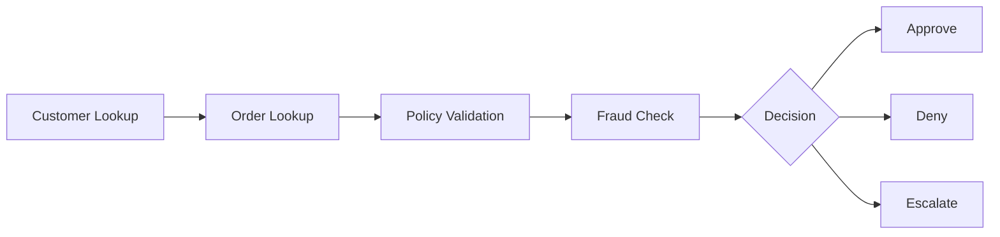

# RefundFlow AI — AI Customer Support Agent

An AI customer support agent for an e-commerce store. A customer chats with the assistant to request a refund; an agent built with **LangGraph** looks up the customer and the order, validates the request against a strict refund policy, runs a fraud check, and then **approves**, **denies**, or **escalates** the refund. An admin console shows the agent's reasoning, tool calls, and full execution trace **in real time**.

Built with FastAPI + LangGraph on the backend and React + TypeScript on the frontend.


## How it maps to the challenge

| Requirement | Where it lives |
|---|---|
| Mock CRM database (15 profiles) | `backend/data/customers.json` — 15 realistic profiles including a VIP, a repeat refund abuser, a brand-new customer, and a high-fraud-risk customer |
| Strict refund policy document | `backend/data/refund_policy.md` — 7 rules with severities and reason codes |
| Agent backend with dynamic tool calls | `backend/app/agents/` — a LangGraph workflow that calls 4 tools (customer lookup, order lookup, policy validator, fraud check) and routes to Approve / Deny / Escalate |
| Customer chat interface | The default view — a clean, helpdesk-style chat |
| Admin dashboard with real-time reasoning logs | The second sidebar view — live reasoning, tool-call logs, state inspector, and replayable execution history, streamed over Server-Sent Events (no polling) |
| Voice pipeline (bonus) | Not implemented; the event-driven backend leaves a clean seam for a LiveKit/Realtime integration |

## What happens when a customer asks for a refund

1. The customer submits an order ID and a reason in the chat.
2. The LangGraph agent runs five nodes in sequence — four tool-calling nodes followed by a decision node:



3. The policy validator checks every rule in the policy document: 30-day refund window, final-sale and digital-product exclusions, max 3 refunds per 6 months, fraud thresholds, and evidence requirements for damage claims.
4. The decision node combines those signals. Any hard violation denies; conflicting signals (for example a VIP customer outside the refund window, or borderline fraud with an otherwise clean history) **escalate to a human** instead of auto-denying.
5. The customer gets a short, friendly reply. The admin console gets the full story: every tool call with inputs/outputs and duration, the agent's reasoning at each step, the state after every node, and the final decision with its reason codes.

## The key design decision

**The LLM never makes the refund decision.** Deterministic tools and a policy engine decide; the LLM is only used to phrase the customer-facing reply — and it is given only a pre-computed, customer-safe reason, never the internal rationale, so signals like fraud scores can't leak into the chat. This makes every decision reproducible, auditable, and safe — and it means the whole app runs with **no API key at all**, falling back to a templated responder. With an API key, Anthropic works out of the box; any other major provider (OpenAI, Gemini, Groq, Mistral, Ollama) plugs in with a few lines of `.env` config (see [Using a real LLM](#using-a-real-llm-optional)).

## Quickstart

Backend (Python 3.12+):

```bash
cd backend
python3 -m venv .venv && source .venv/bin/activate
pip install -r requirements.txt
uvicorn app.main:app --reload --port 8000
```

Frontend (Node 18+):

```bash
cd frontend
npm install
npm run dev
```

Open http://localhost:5173 — chat is the default view; the admin console is the second icon in the sidebar (or http://localhost:5173/?view=admin). API docs: http://localhost:8000/docs.

No configuration is required to run the demo.

## Demo scenarios

One-click chips in the chat exercise every decision path:

| Scenario | Customer | Outcome and why |
|---|---|---|
| Happy path | CUST-001 (VIP, clean history) | **Approved** — in window, low risk |
| Repeat refund abuser | CUST-004 (4 refunds in 6 months) | **Denied** — refund frequency cap |
| VIP outside refund window | CUST-007 | **Escalated** — conflicting signals, human review |
| Digital product | CUST-002 | **Denied** — digital goods non-refundable |
| High fraud risk | CUST-009 (risk 0.86) | **Denied** — fraud threshold |
| New customer, borderline risk | CUST-012 (12-day-old account) | **Escalated** — low confidence |

## Admin console


- **Timeline** — node-by-node graph execution, lighting up live
- **Reasoning** — the agent's step-by-step thoughts (this is where the "why" lives; the customer only sees the outcome)
- **Events** — every lifecycle event with payloads and durations, filterable to tool calls only
- **State** — the agent's state after every node (customer data, order data, policy result, fraud result)
- **History** — every past run stored in SQLite, click any session to replay its full trace

## Using a real LLM (optional)

Set a provider and key in `backend/.env` — supports Anthropic, OpenAI, Google Gemini, Groq, Mistral, Ollama (local), or any OpenAI-compatible endpoint:

```ini
LLM_PROVIDER=groq
LLM_MODEL=llama-3.3-70b-versatile
GROQ_API_KEY=gsk_your_key_here
```

Install the matching package (`pip install langchain-groq`) and restart. Without a key the app uses a deterministic template responder, so the demo always works.

## Tech stack

| Layer | Technology |
|---|---|
| Agent workflow | LangGraph (state machine with checkpointing) |
| Backend | FastAPI, Pydantic v2, SQLAlchemy, SQLite, structlog |
| Real-time | Server-Sent Events (sse-starlette) |
| Frontend | React 18, TypeScript, Vite, TailwindCSS, Framer Motion |
| Data fetching / state | TanStack Query, Zustand |
| Testing | pytest (41 backend tests), Vitest + React Testing Library |

## Project structure

```text
backend/
  app/
    agents/        LangGraph state, nodes, and graph wiring
    tools/         the 4 deterministic agent tools
    services/      business logic (decision engine, phrasing, traces)
    repositories/  data access (CRM JSON + SQLite traces)
    api/v1/        REST + SSE routes (no business logic in routes)
    schemas/       Pydantic request/response models
  data/            customers.json, orders.json, refund_policy.md
  tests/
frontend/
  src/
    components/    chat/, dashboard/, logs/, ui/
    hooks/ store/  React Query hooks, Zustand store
    api/           typed REST client + SSE subscription
```

Architecture deep-dive with diagrams: [docs/ARCHITECTURE.md](docs/ARCHITECTURE.md)

## Tests

```bash
cd backend && pytest        # agent flow, tools, policy engine, phrasing, API
cd frontend && npm test     # component and timeline-logic tests
```

## Notes

- **Demo scope:** this is a self-contained demo with no authentication. The customer chat and the admin console are two views of one app, so the `/chat` API returns the full trace for the admin dashboard to render. In production these would be split: a slim customer response and an authenticated admin/observability stream. The customer-facing *message* itself is always sanitized.
- **Voice (bonus):** not implemented. The event-driven backend (SSE) is structured to make adding a LiveKit / OpenAI Realtime voice channel straightforward.

## Walkthrough video

> 🎥 _Add your Loom link here._ Suggested 7-10 min flow: run the approve scenario in chat, switch to the admin console to show the live reasoning and tool calls, then demo a denial and an escalation, and finish with a historical trace replay.
