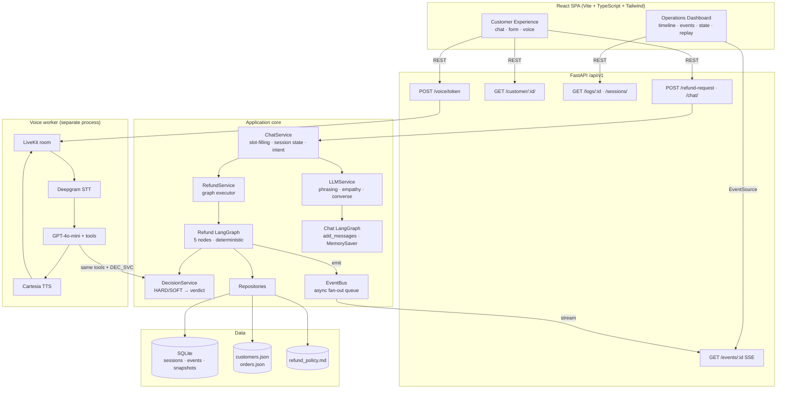
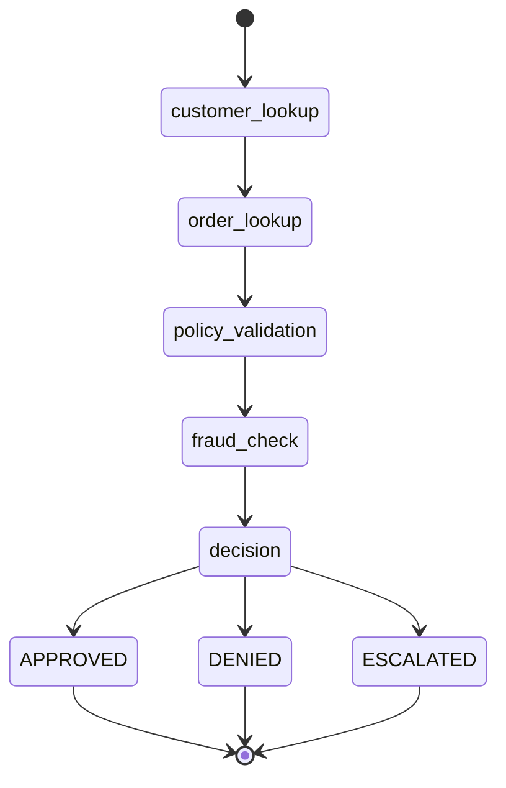
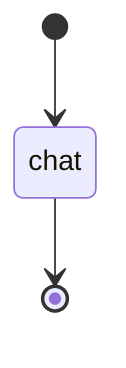
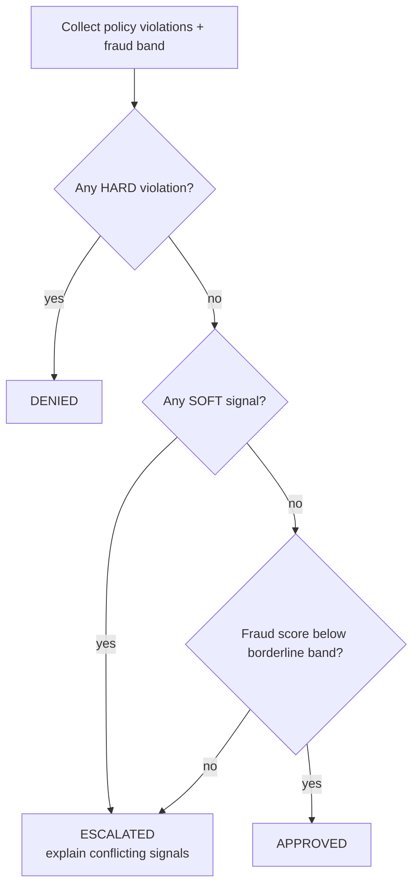
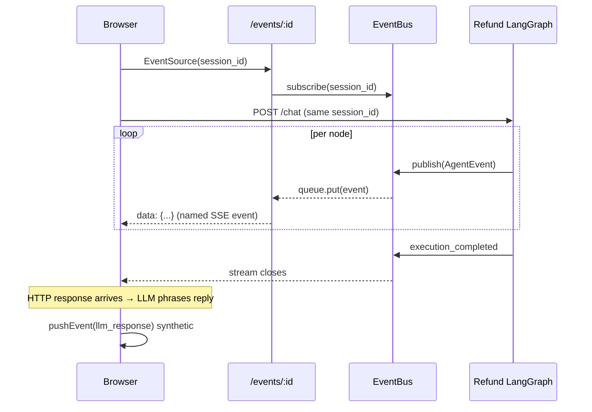
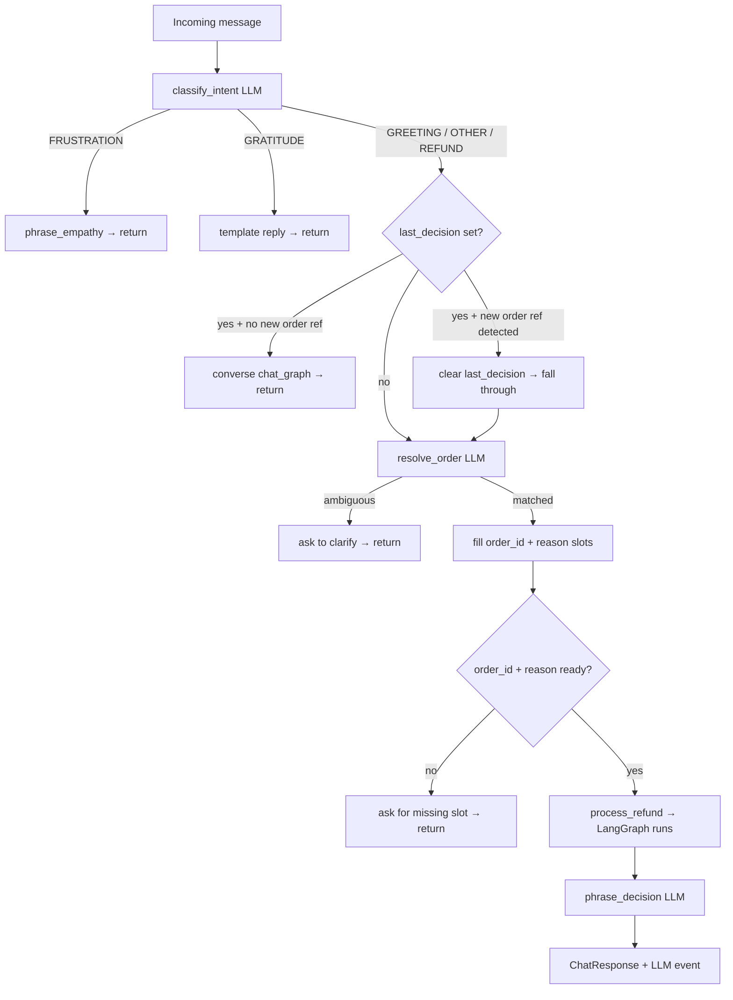

# Architecture

The guiding principle: **the LLM orchestrates and phrases; deterministic tools + policy decide.**

Every refund verdict is computed by a deterministic state machine and a policy engine. The LLM only phrases the customer-facing reply — and it is given only a customer-safe summary of the verdict, never the internal rationale. This makes every decision reproducible, auditable, and independent of LLM availability.

---

## 1. System overview



---

## 2. Layering (Clean Architecture)

| Layer | Responsibility | May depend on |
|---|---|---|
| `api/` | HTTP transport, (de)serialization, status codes | `services`, `schemas` |
| `services/` | Business logic and orchestration | `agents`, `repositories`, `schemas` |
| `agents/` | LangGraph workflow nodes (orchestrate only, no business logic) | `tools`, `services` (decision, observer) |
| `tools/` | Deterministic instruments (always same output for same input) | `repositories`, `schemas` |
| `repositories/` | Data access (JSON + SQLite) | `models`, `schemas` |
| `models/` | SQLAlchemy ORM tables | — |
| `schemas/` | Pydantic request/response contracts | — |

Dependencies point **inward**. Routes and nodes contain no business logic. The decision is composed entirely in `DecisionService`, which is a pure function of its inputs and is exhaustively unit-tested without the network.

---

## 3. Two-graph architecture

The system runs two separate LangGraphs for two different purposes:

### 3a. Refund LangGraph (deterministic decision pipeline)



**Purpose:** compute the refund verdict.  
**LLM involvement:** none — the graph is 100% deterministic.  
**State:** `AgentState` TypedDict; checkpointed per `session_id` with `MemorySaver`.  
**Persistence:** every node emits a state snapshot to SQLite for dashboard replay.

Each node:
1. Emits `node_entered`
2. Calls a deterministic tool (emitting `tool_called` / `tool_completed`)
3. Appends a structured reasoning entry
4. Writes a state snapshot
5. Returns a partial state update merged by LangGraph

### 3b. Chat LangGraph (conversational memory loop)



**Purpose:** phrase back-and-forth replies after a decision has been made.  
**State:** `ChatState` with `messages: Annotated[list, add_messages]` — the `add_messages` reducer appends each turn to the persisted history instead of replacing it.  
**Memory:** `MemorySaver` checkpointed by `conversation_id` — the assistant remembers the entire thread across turns.  
**LLM involvement:** the single `chat` node calls the LLM with the full history + a context-aware system prompt.

This graph only *phrases* — it never adjudicates. The refund verdict from Graph 3a is injected as immutable context into the system prompt; the chat node cannot change, reverse, or re-run it.

---

## 4. Decision matrix



Severity is assigned by `policy_validator`:
- `HARD` violation → auto-DENY regardless of other signals
- `SOFT` violation → ESCALATE (conflicting signals need human review)
- VIP exception: `WINDOW_EXCEEDED` is downgraded from HARD to SOFT so a VIP outside the refund window escalates rather than auto-denying

Fraud bands (configurable in `settings.py`):
- Score ≥ 0.70 → HARD deny (`FRAUD_THRESHOLD`)
- Score 0.55–0.69 → SOFT escalate (`FRAUD_BORDERLINE`)
- Score < 0.55 → no fraud signal

---

## 5. Real-time observability (SSE)



**Key invariant:** the browser opens the EventSource **before** firing the POST, so no event is missed even on a fast execution. The `onopen` callback fires the POST.

**EventBus:** in-process `asyncio.Queue` fan-out (one queue per subscriber). The single seam to swap for Redis pub/sub in a multi-replica deployment.

**LLM event timing:** the LLM phrasing runs *after* `process_refund()` returns (and after `execution_completed` closes the SSE stream). It is surfaced two ways:
1. Persisted to SQLite as an `llm_response` event (visible in historical replay)
2. Pushed as a synthetic client-side event in `useAgentRun.ts` after the HTTP response arrives (visible in the live feed)

---

## 6. Chat service flow (slot-filling state machine)



`ChatSessionState` (in-memory, keyed by `conversation_id`) tracks: `order_id`, `reason`, `evidence_provided`, `last_decision`, `last_order_id`, `refund_runs`. A follow-up that references a new order ID automatically resets `last_decision` and starts a fresh refund flow.

---

## 7. LLM service responsibilities

`LLMService` is the only point in the system that touches the LLM for customer-facing output. It has five methods:

| Method | Purpose | Fallback |
|---|---|---|
| `classify_intent` | Classify message into GREETING / GRATITUDE / FRUSTRATION / REFUND_REQUEST / OTHER | Keyword heuristic |
| `resolve_order` | Map free-text message to one of this customer's orders + extract reason | Token overlap matching |
| `phrase_decision` | Phrase the customer reply for a APPROVED / DENIED / ESCALATED verdict | Deterministic template |
| `phrase_empathy` | Phrase a warm, concise reply to a frustrated message | Deterministic template |
| `converse` | Multi-turn follow-up via `ConversationEngine` (Chat LangGraph) | Template follow-up |

All five methods degrade to deterministic fallbacks when no LLM is configured or a call fails. The app never surfaces an LLM error to the customer.

**Guardrails on all prompts:**
- 1-2 sentence limit, no long paragraphs
- Off-topic refusal ("politely decline in one line and steer back")
- No hallucination ("NEVER invent order details, amounts, dates, policies")
- No repetition ("read the history and do NOT repeat yourself")
- Empathetic, soft, professional tone
- Internal information never included in prompts: fraud scores, policy rule IDs, internal rationale

---

## 8. Voice architecture

The voice channel is a separate long-running **LiveKit Agents** worker (`backend/voice_agent.py`). It runs alongside uvicorn — not inside it.

```
Browser mic → WebRTC → LiveKit Cloud room
    → Deepgram nova-3 (STT)
    → Silero VAD + multilingual turn detector
    → GPT-4o-mini + 3 function tools
        ├── list_my_orders        (calls OrderRepository)
        ├── look_up_order         (calls OrderLookupTool, verifies account ownership)
        └── check_refund_eligibility  (FraudCheckTool → PolicyValidatorTool → DecisionService)
    → Cartesia Sonic (TTS)
    → WebRTC → Browser speaker
```

Identity is established from the LiveKit room name (`refundflow-<customer_id>`) parsed at worker startup — the customer is never asked to speak their ID. All tools reject orders not owned by the authenticated caller.

---

## 9. Data model (SQLite)

Three tables, created on first start via SQLAlchemy:

| Table | Columns | Purpose |
|---|---|---|
| `agent_sessions` | `session_id`, `customer_id`, `order_id`, `status`, `final_decision`, `created_at`, `completed_at` | One row per agent run — drives the History list |
| `agent_events` | `id`, `session_id`, `event_type`, `node_name`, `tool_name`, `message`, `payload` (JSON), `duration_ms`, `created_at` | Every observable event including `llm_response` — drives the Events and Reasoning tabs |
| `agent_state_snapshots` | `id`, `session_id`, `graph_node`, `state_snapshot` (JSON), `created_at` | State after every node — drives the State Inspector |

---

## 10. Why these choices

| Choice | Rationale |
|---|---|
| **LangGraph state machine** (not a chat loop) | Explicit nodes, conditional routing, replayable state — the graph structure is the documentation |
| **Deterministic decision engine** | Auditable, reproducible, runs offline; LLM failure never corrupts a verdict |
| **Two separate graphs** | Refund pipeline (linear, deterministic) and chat loop (cyclic, LLM-driven) have opposite properties — mixing them in one graph would make both harder to reason about |
| **Repository + Service layers** | Storage-agnostic business logic; `DecisionService` is a pure function trivially tested without a database or network |
| **SSE over WebSocket / polling** | The event stream is one-directional and event-shaped; SSE is simpler, HTTP-native, and proxied transparently |
| **structlog JSON** | Every log line carries `trace_id`, `session_id`, `node`, `duration_ms` — structured and ready for an observability backend |
| **MemorySaver checkpointer** | Gives in-graph resume/inspection; a separate `agent_state_snapshots` table gives durable, queryable replay for the dashboard — two complementary persistence layers |
| **`add_messages` reducer in Chat LangGraph** | Appends turns without replacing state; the full conversation history is always available to the LLM at each turn, enabling genuine back-and-forth |
