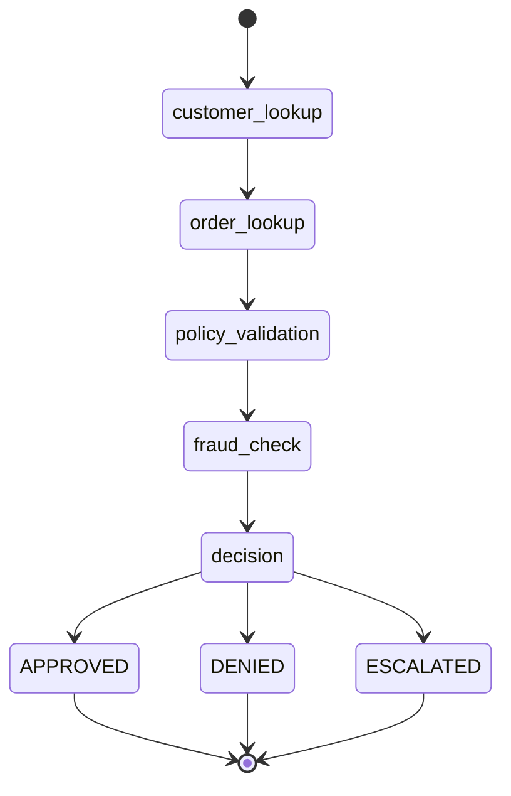
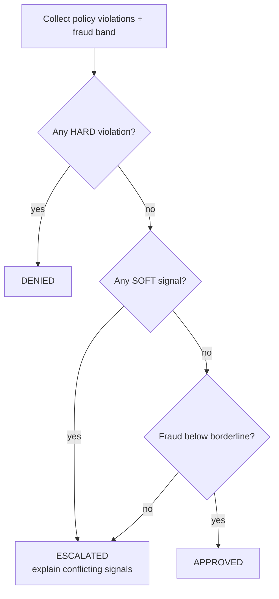
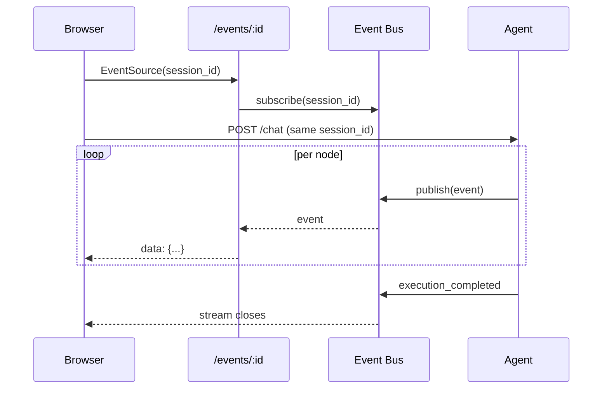

# Architecture

This document explains the system structure and the rationale behind each major
decision. The guiding principle throughout: **the LLM orchestrates and phrases;
deterministic tools + policy decide.**

---

## 1. System architecture

```mermaid
graph TD
    subgraph Browser["React SPA (Vite + TS + Tailwind)"]
        CHAT[Customer Experience<br/>chat · form · profile]
        DASH[Operations Dashboard<br/>timeline · feed · state · replay]
    end

    subgraph API["FastAPI · /api/v1"]
        R_REFUND[/refund-request · /chat/]
        R_CUST[/customer/:id/]
        R_LOGS[/logs/:id · /sessions/]
        R_SSE[/events/:id  (SSE)/]
    end

    subgraph Core["Application core"]
        SVC[Services<br/>refund · chat · decision · trace]
        AGENT[LangGraph Agent]
        TOOLS[Tools<br/>customer · order · policy · fraud]
        BUS[Event Bus]
        REPO[Repositories]
    end

    subgraph Data["Data"]
        DB[(SQLite<br/>sessions · events · snapshots)]
        JSON[(customers.json<br/>orders.json)]
        MD[(refund_policy.md)]
    end

    CHAT -->|REST| R_REFUND
    CHAT -->|REST| R_CUST
    DASH -->|REST| R_LOGS
    DASH -->|EventSource| R_SSE

    R_REFUND --> SVC
    R_CUST --> REPO
    R_LOGS --> REPO
    SVC --> AGENT
    AGENT --> TOOLS
    AGENT -->|emit| BUS
    AGENT -->|persist| REPO
    BUS -->|stream| R_SSE
    TOOLS --> JSON
    TOOLS --> MD
    REPO --> DB
```

### Layering (Clean Architecture)

| Layer | Responsibility | May depend on |
|---|---|---|
| `api/` | HTTP transport, (de)serialization, status codes | `services`, `schemas` |
| `services/` | Business logic & orchestration | `agents`, `repositories`, `schemas` |
| `agents/` | LangGraph workflow (nodes orchestrate only) | `tools`, `services` (decision/observer) |
| `tools/` | Deterministic instruments | `repositories`, `schemas` |
| `repositories/` | Data access | `models`, `schemas` |
| `models/` | ORM tables | — |
| `schemas/` | Typed contracts | — |

Dependencies point **inward**. Routes and nodes contain no business logic; the
decision is composed in `DecisionService`, which is a pure function of its
inputs and is exhaustively unit-tested.

---

## 2. Agent workflow



Each node:
1. emits `node_entered`,
2. calls a tool (emitting `tool_called` / `tool_completed`),
3. appends a reasoning entry,
4. writes a **state snapshot**,
5. returns a partial state update that LangGraph merges.

The graph is compiled with a **`MemorySaver` checkpointer** keyed by
`session_id` (the graph thread), giving in-graph resume/inspection. A separate
`agent_state_snapshots` table gives durable, queryable replay for the dashboard —
two complementary forms of persistence.

---

## 3. Decision matrix



Severity is assigned by the policy validator (`HARD` vs `SOFT`); for example a
VIP whose refund window lapsed produces a **SOFT** `WINDOW_EXCEEDED`, which
escalates rather than auto-denying — the canonical "conflicting signals" case.

---

## 4. Real-time observability (SSE)



The browser opens the stream **first** and fires the run on `onopen`, so no
event is missed. The bus is an in-process async fan-out (one queue per
subscriber) — the single seam to swap for Redis pub/sub in a multi-replica
deployment.

---

## 5. Why these choices

- **Deterministic decisioning** → auditable, reproducible, and runs with no API
  key (the LLM phrasing layer degrades to templates).
- **LangGraph state machine** (not a chat loop) → explicit nodes, conditional
  routing, replayable state.
- **Repository + Service layers** → storage-agnostic business logic, trivially
  mockable in tests.
- **structlog JSON** → every log carries `trace_id` / `session_id` / `node` /
  `duration_ms`, ready to ship to a real observability backend.
- **SSE over polling** → the data is one-way and event-shaped.
